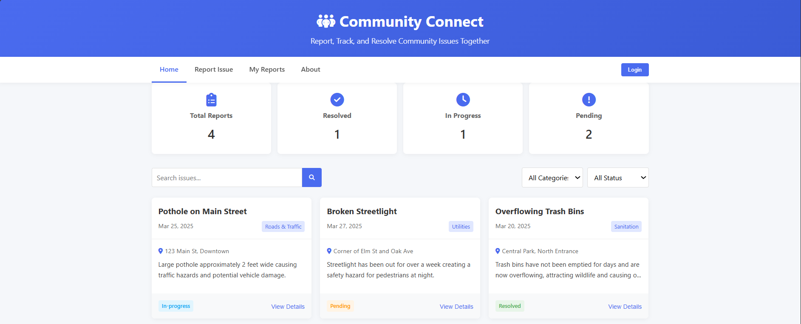
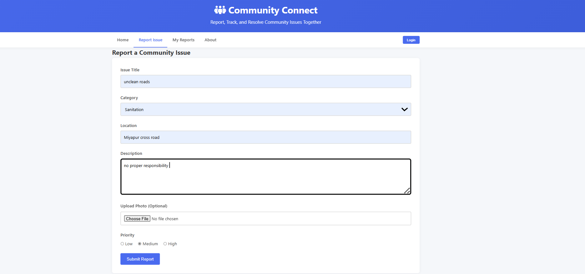
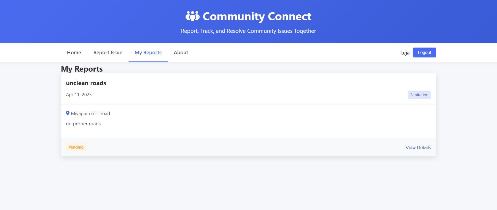

# Community Connect - Issues Reporting and Resolution Platform

**Community Connect** is a web-based platform where residents can report, track, and resolve local community issues such as potholes, sanitation, broken streetlights, or public safety concerns.

## 🌟 Features

- 📌 Submit and track community issues
- 📊 Dashboard with issue stats (Pending, In Progress, Resolved)
- 🔍 Filter and search through reported issues
- 🗣️ Comment and upvote issues
- 👤 User login and registration
- 📱 Mobile responsive design

## 🛠️ Tech Stack

- **Frontend:** HTML5, CSS3, JavaScript (Vanilla)
- **UI Icons:** Font Awesome

> This is a frontend-only demo. Data is currently stored in-memory and resets on reload. Backend/API integration can be added later.

## 🚀 Getting Started

To run the project locally:

1. Clone the repository:
    ```bash
    git clone https://github.com/yourusername/community-connect.git
    cd community-connect
    ```

2. Open `index.html` in your browser (no server required):
    ```bash
    open index.html
    ```

> For best experience, use [Live Server](https://marketplace.visualstudio.com/items?itemName=ritwickdey.LiveServer) in VS Code.


### Dashboard


### Report Issue Form


### My Reports Section



## 📂 Project Structure

```text
index.html       # Main HTML structure
styles.css       # Styling and responsive design
script.js        # Functionality and logic (issues, filters, auth)
---
## 🙋‍♂️ Connect with Me

- GitHub: [github.com/BERAN TEJA](https://github.com/Tejaaa14)
- LinkedIn: [linkedin.com/in/Beran Teja Kolluri](https://linkedin.com/in/beran-teja-kolluri-93271b336/)

